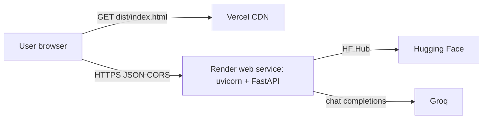

# Phase 8 — Deployment plan: Render (backend) + Vercel (frontend)

This document is the canonical guide for deploying Milestone 1 as **two independent services**:

- **Backend** — FastAPI app from `src/milestone1/phase6_api/` on **Render**.
- **Frontend** — Vite + React SPA from `frontend/` on **Vercel**.

The browser bundle is purely static and only talks to the Render URL over HTTPS. Provider keys (`GROQ_API_KEY`, optional `HF_TOKEN`) live **only** on Render.



---

## 0. One-time prep in the repo

The repo already builds cleanly for both targets — Render reads `pyproject.toml`, Vercel reads `frontend/package.json`. Two small additions make the deploy reproducible without clicking around dashboards.

### 0.1 Pin a Python version for Render

Add a `runtime.txt` at the repo root so Render uses Python 3.11 (matches `requires-python` in `pyproject.toml`):

```text
python-3.11.9
```

### 0.2 Optional: `render.yaml` (Infrastructure-as-Code)

Render can read a `render.yaml` blueprint at the repo root to provision the service automatically:

```yaml
services:
  - type: web
    name: milestone1-api
    runtime: python
    plan: free
    buildCommand: pip install -e .
    startCommand: uvicorn milestone1.phase6_api.app:app --host 0.0.0.0 --port $PORT
    healthCheckPath: /health
    autoDeploy: true
    envVars:
      - key: GROQ_API_KEY
        sync: false
      - key: GROQ_MODEL
        sync: false
      - key: HF_TOKEN
        sync: false
      - key: CORS_ORIGINS
        sync: false
```

`sync: false` keeps secret values out of the repo; you set them in the Render dashboard.

### 0.3 Optional: `frontend/vercel.json`

Vercel auto-detects Vite, but a small config makes SPA fallback explicit and avoids surprises if you add client-side routing later:

```json
{
  "buildCommand": "npm run build",
  "outputDirectory": "dist",
  "installCommand": "npm install",
  "framework": "vite",
  "rewrites": [
    { "source": "/(.*)", "destination": "/index.html" }
  ]
}
```

---

## 1. Deploy the backend on Render

### 1.1 Create the service

1. Push the repo to GitHub.
2. Render dashboard → **New** → **Web Service** → connect the GitHub repo.
3. If you committed `render.yaml`, choose **Blueprint** and Render fills in the rest. Otherwise use the manual settings below.

### 1.2 Manual settings (if not using `render.yaml`)

| Field | Value |
|-------|-------|
| Environment | **Python 3** |
| Region | nearest free region |
| Branch | `main` |
| Root Directory | *(blank — repo root)* |
| Build Command | `pip install -e .` |
| Start Command | `uvicorn milestone1.phase6_api.app:app --host 0.0.0.0 --port $PORT` |
| Health Check Path | `/health` |
| Plan | Free (or paid for no cold starts) |

`milestone1.phase6_api.app:app` exists at module scope in `src/milestone1/phase6_api/app.py` (`app = create_app()`), so uvicorn can import it without running the `milestone1-api` console script. The startup hook **prewarms** the city list in a background thread, so the first `/api/v1/meta` and `/api/v1/recommendations` calls do not pay the full Hugging Face load cost.

### 1.3 Environment variables on Render

Set in **Environment → Environment Variables**:

| Var | Required? | Purpose |
|-----|-----------|---------|
| `GROQ_API_KEY` | **yes** | Phase 4 LLM calls. Get from <https://console.groq.com/keys>. |
| `GROQ_MODEL` | optional | Override default Groq model id (default: `llama-3.3-70b-versatile`). |
| `HF_TOKEN` | optional | Higher Hugging Face Hub rate limits when streaming the dataset. |
| `CORS_ORIGINS` | **yes (after Vercel deploy)** | Comma-separated list of allowed browser origins. See §3. |
| `PORT` | auto | Render injects this; the app reads it via `uvicorn ... --port $PORT`. |
| `PREWARM` | recommended `0` on free tier | Set to `0` to skip the boot-time locations preload (see §1.5). |
| `LOAD_LIMIT` | recommended `3000` on free tier | Caps Hub rows scanned per request; lower = less RAM (see §1.5). |

Do **not** add `API_HOST` — the start command already binds `0.0.0.0`.

### 1.4 Verify

After the first deploy, hit:

- `https://<service>.onrender.com/health` → `{"status":"ok","groq_configured":true}`
- `https://<service>.onrender.com/api/v1/meta?cities_cap=20` → JSON with a `cities` array
- `https://<service>.onrender.com/docs` → Swagger UI

Note the service URL — it goes into the Vercel build env next.

> **Cold starts:** Render free-tier services sleep after ~15 minutes of inactivity. The first request after sleep can take 30–60 s. The Phase 6 prewarm thread reduces *post-startup* latency but does not eliminate the dyno boot itself. If demos need snappy first hits, upgrade the plan or hit `/health` from an uptime pinger (Better Stack / cron-job.org).

### 1.5 Memory budget on the free tier (512 MB)

Render's free Python web service is hard-capped at **512 MB RSS**. The dataset + LLM stack lands close to that cap by default, so the deploy ships two tunables:

| Tunable | Default | On Render free | Effect |
|---------|---------|----------------|--------|
| `PREWARM` | `1` (on) | **`0`** | When off, the startup hook skips the background thread that loads ~8 000 rows into memory. The first `/api/v1/meta` call pays that cost on demand instead, against an already-warm process — and only once until the dyno sleeps. |
| `LOAD_LIMIT` | `8000` | **`3000`** | Caps the per-request Hugging Face streaming scan. Each row is a normalized `Restaurant` dataclass. Halving the cap roughly halves the per-request transient allocation. |

Both are pre-wired in `render.yaml`; no dashboard action required.

**What's also pruned in code:** Phase 1 normalization (`row_to_restaurant`) deliberately discards Hub columns no downstream phase reads — `address`, `menu_sample`, `dishes_liked`, `phone`, `url`, `restaurant_type`, `listing_type`, `online_order`, `book_table`, `approx_cost_two_raw`. On this dataset, `menu_item` and `dishes_liked` alone can be tens of KB per row; dropping them keeps a 3 000-row in-memory load under ~10 MB.

If the instance still OOMs:

1. Lower `LOAD_LIMIT` further (e.g. `2000`, then `1500`). Trade-off: smaller candidate pool, fewer cities in `/api/v1/meta`.
2. Confirm `PREWARM=0` and that you're not running multiple uvicorn workers (the start command in `render.yaml` is single-worker by default — do not add `--workers 2`).
3. Last resort: bump to a paid Render plan with more RAM. The 1 GB tier deletes the constraint; bump back the env vars to the defaults above.

---

## 2. Deploy the frontend on Vercel

### 2.1 Create the project

1. Vercel dashboard → **Add New → Project** → import the same GitHub repo.
2. **Root Directory:** `frontend/` (critical — without this Vercel tries to build the Python project).
3. **Framework Preset:** Vite (auto-detected).
4. Build / Output should auto-fill from `package.json`:
   - **Install:** `npm install`
   - **Build:** `npm run build`
   - **Output:** `dist`

### 2.2 Environment variables on Vercel

Add under **Settings → Environment Variables**, scoped to **Production** (and **Preview** if you want previews to hit the same backend):

| Var | Value |
|-----|-------|
| `VITE_API_BASE_URL` | `https://<your-render-service>.onrender.com` (no trailing slash) |

Vite inlines `VITE_*` vars at build time, so a redeploy is needed to pick up changes (Vercel does this automatically on env-var save).

> **Never** put `GROQ_API_KEY` in any `VITE_*` var — `frontend/src/lib/api.ts` only ever calls `${VITE_API_BASE_URL}/...`, and that boundary is what keeps provider keys server-side.

### 2.3 Verify

After deploy:

- `https://<project>.vercel.app/` loads the SPA.
- DevTools → Network → submit the form → request goes to `https://<render>.onrender.com/api/v1/recommendations` and returns 200.
- If the request is blocked by the browser with a CORS error, you have not yet completed §3.

---

## 3. Wire CORS on Render to the Vercel origin

`src/milestone1/phase6_api/app.py` reads `CORS_ORIGINS` (comma-separated). Set it on Render to the exact origins the browser will use:

```text
CORS_ORIGINS=https://<project>.vercel.app,https://<project>-git-main-<team>.vercel.app
```

Common gotchas:

- **No trailing slash, no path.** Origin only: `https://foo.vercel.app`, not `https://foo.vercel.app/`.
- **Custom domain?** Add it too: `CORS_ORIGINS=https://app.example.com,https://<project>.vercel.app`.
- **Preview deploys** get unique subdomains. Either disable preview-env builds, point them at a separate staging Render service, or temporarily widen `CORS_ORIGINS` while testing — never to `*` for a credentialed app.

After saving the env var, Render restarts the service. Re-test the SPA call from the browser.

---

## 4. Smoke-test checklist

Run these in order from the deployed Vercel URL:

1. Page loads, hero + form render, no console errors.
2. `GET /api/v1/meta` populates the city dropdown (visible on first paint, served by Render).
3. Submit form with a valid city → status badge shows `source: llm` and ranked cards render.
4. Submit with an obviously empty filter combo (e.g. min rating 5 + a quiet city) → renders the **no candidates** empty state copy from Phase 5.
5. Tail Render logs (`Logs` tab) — request lines appear with `200`, telemetry JSON is logged on stderr.

If any step fails, see §5.

---

## 5. Troubleshooting

| Symptom | Likely cause / fix |
|--------|---------------------|
| Browser shows `CORS error` | `CORS_ORIGINS` on Render does not include the exact Vercel origin. Update env var, wait for restart. |
| `Failed to fetch` from frontend | `VITE_API_BASE_URL` missing or wrong. Confirm value, then redeploy on Vercel. |
| `groq_configured: false` from `/health` | `GROQ_API_KEY` not set on Render, or has whitespace. Re-paste, redeploy. |
| First request hangs ~30 s | Render free-tier cold start. Ping `/health` first, or upgrade plan. |
| `/api/v1/meta` 500s with HF errors | Hugging Face throttle. Set `HF_TOKEN` on Render, or lower `load_limit`. |
| Vercel build fails on `tsc --noEmit` | Same TS error you would see locally — fix in `frontend/`, push, Vercel rebuilds. |
| Render build fails on `pip install -e .` | Confirm `runtime.txt` is `python-3.11.x`; Render's default Python may be too old. |
| Render logs `Ran out of memory (used over 512MB)` | Free-tier RSS cap. Confirm `PREWARM=0` and lower `LOAD_LIMIT` (try `2000`, then `1500`). See §1.5. |

---

## 6. Rollback

- **Backend:** Render keeps a deploy history; **Manual Deploy → Rollback** to a previous build.
- **Frontend:** Vercel’s **Deployments** tab → **Promote to Production** on a known-good build.

Both platforms support instant rollback without rebuilding.

---

## 7. Cost shape (free-tier)

| Resource | Free tier | Notes |
|----------|-----------|-------|
| Render web service | 750 hrs/month | Sleeps when idle (cold starts). |
| Vercel hobby | 100 GB bandwidth, 6k build min/month | Static SPA is essentially free at this scale. |
| Groq | Free dev quota | Keep `candidate_cap` modest in the API request body. |
| Hugging Face Hub | Anonymous | Add `HF_TOKEN` if you hit rate limits. |

For demos and coursework, the free tiers are sufficient. For a graded review, hit `/health` once before the demo to wake the Render dyno.
