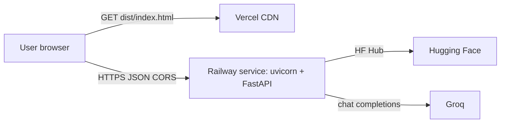

# Phase 8 — Deployment plan: Railway (backend) + Vercel (frontend)

This document is the canonical guide for deploying Milestone 1 as **two independent services**:

- **Backend** — FastAPI app from `src/milestone1/phase6_api/` on **Railway**.
- **Frontend** — Vite + React SPA from `frontend/` on **Vercel**.

The browser bundle is purely static and only talks to the Railway URL over HTTPS. Provider keys (`GROQ_API_KEY`, optional `HF_TOKEN`) live **only** on Railway.



---

## 0. One-time prep in the repo

The repo already builds cleanly for both targets — Railway reads `pyproject.toml` via Nixpacks, Vercel reads `frontend/package.json`. A few small files at the repo root make the deploy reproducible without clicking around dashboards.

### 0.1 Pin a Python version

`runtime.txt` at the repo root (already committed) tells Nixpacks which Python to install — same file works for Heroku-style buildpacks and several other PaaSes:

```text
python-3.11.9
```

This matches `requires-python = ">=3.11"` in `pyproject.toml`.

### 0.2 `railway.toml` (Infrastructure-as-Code)

Railway reads `railway.toml` (or `railway.json`) at the repo root and uses it as the service blueprint. The committed file:

```toml
[build]
builder = "NIXPACKS"

[deploy]
startCommand = "/opt/venv/bin/uvicorn milestone1.phase6_api.app:app --host 0.0.0.0 --port $PORT"
healthcheckPath = "/health"
healthcheckTimeout = 30
restartPolicyType = "ON_FAILURE"
restartPolicyMaxRetries = 3
```

Notes:

- **Builder** is Nixpacks (Railway's default). It picks the Python version from `runtime.txt`, then installs the project according to `nixpacks.toml` (see §0.3).
- **Start command** points at the absolute path of `uvicorn` inside the Nixpacks venv (`/opt/venv/bin/uvicorn`), so it doesn't depend on PATH inheritance from the build phase. `milestone1.phase6_api.app:app` is module-scope (`app = create_app()`), so uvicorn imports it without invoking the `milestone1-api` console script.
- **Health check** points at `/health`. Railway will mark the deploy unhealthy and roll back if `/health` doesn't return 2xx within `healthcheckTimeout` seconds.
- **Restart policy** auto-recovers on transient crashes (e.g. HF Hub timeouts) up to 3 times before failing the deploy.

Secrets and tunables are **not** in this file — they live in the Railway dashboard's **Variables** panel (see §1.3).

### 0.3 `nixpacks.toml` (build phase override)

Nixpacks' default Python provider runs `pip install .` in the **install phase**, which only has `pyproject.toml` copied into it (not `src/` or `README.md`). Our project uses a src-layout via `[tool.setuptools.packages.find] where = ["src"]` and `readme = "README.md"`, so setuptools fails the build with:

```
File '/app/README.md' cannot be found
error in 'egg_base' option: 'src' does not exist or is not a directory
```

The committed `nixpacks.toml` fixes this by keeping the install phase to package-management tools only and deferring `pip install .` to the **build phase**, which runs *after* the full source tree has been copied into `/app`:

```toml
providers = ["python"]

[phases.install]
cmds = [
  "python -m venv --copies /opt/venv",
  ". /opt/venv/bin/activate && pip install --upgrade pip setuptools wheel",
]

[phases.build]
cmds = [
  ". /opt/venv/bin/activate && pip install .",
]
```

Docker layer caching for pip/setuptools/wheel still works (their layer is keyed on `pyproject.toml`'s hash, which only changes when deps change). The Python interpreter is still selected by `runtime.txt` via Nixpacks' default setup phase.

### 0.4 Optional: `frontend/vercel.json`

Vercel auto-detects Vite, but a small config makes SPA fallback explicit and avoids surprises if you add client-side routing later:

```json
{
  "buildCommand": "npm run build",
  "outputDirectory": "dist",
  "installCommand": "npm install",
  "framework": "vite",
  "rewrites": [
    { "source": "/(.*)", "destination": "/index.html" }
  ]
}
```

---

## 1. Deploy the backend on Railway

### 1.1 Create the project

The fastest path is the dashboard:

1. Push the repo to GitHub.
2. Railway dashboard → **New Project** → **Deploy from GitHub repo** → pick the repo.
3. Railway detects `railway.toml` automatically. The first build runs Nixpacks → `pip install .` → starts uvicorn.

Optional CLI path (for `railway up` from local):

```bash
npm i -g @railway/cli
railway login
railway link        # picks an existing project, or `railway init` to create one
railway up          # builds and deploys from the working tree
```

### 1.2 Manual settings (only if you skip `railway.toml`)

In the service's **Settings** tab:

| Field | Value |
|-------|-------|
| Builder | **Nixpacks** |
| Root Directory | *(blank — repo root)* |
| Start Command | `uvicorn milestone1.phase6_api.app:app --host 0.0.0.0 --port $PORT` |
| Healthcheck Path | `/health` |
| Healthcheck Timeout | `30` |
| Restart Policy | On failure |

Then add a public domain under **Settings → Networking → Generate Domain** so the service is reachable at `https://<service>.up.railway.app`.

### 1.3 Environment variables on Railway

Set under the service's **Variables** tab:

| Var | Required? | Purpose |
|-----|-----------|---------|
| `GROQ_API_KEY` | **yes** | Phase 4 LLM calls. Get from <https://console.groq.com/keys>. |
| `GROQ_MODEL` | optional | Override default Groq model id (default: `llama-3.3-70b-versatile`). |
| `HF_TOKEN` | optional | Higher Hugging Face Hub rate limits when streaming the dataset. |
| `CORS_ORIGINS` | **yes (after Vercel deploy)** | Comma-separated list of allowed browser origins. See §3. |
| `PORT` | auto | Railway injects this; the start command reads it via `--port $PORT`. |
| `PREWARM` | optional | Set to `0` to skip the boot-time locations preload (see §1.5). |
| `LOAD_LIMIT` | optional | Caps Hub rows scanned per request; lower = less RAM (see §1.5). |

Do **not** add `API_HOST` — the start command already binds `0.0.0.0`.

### 1.4 Verify

After the first deploy, Railway prints the public URL in the service's **Deployments** view. Hit:

- `https://<service>.up.railway.app/health` → `{"status":"ok","groq_configured":true}`
- `https://<service>.up.railway.app/api/v1/meta?cities_cap=20` → JSON with a `cities` array
- `https://<service>.up.railway.app/docs` → Swagger UI

Note the service URL — it goes into the Vercel build env next.

> **Cold starts:** Railway services on the Trial/Hobby plans don't sleep on idle the way some free PaaSes do, so you generally won't pay an HF-load tax on the first request after a quiet period. Crash-restarts and redeploys still incur a Nixpacks build + uvicorn boot.

### 1.5 Memory tunables (only if needed)

Railway's standard plans give services several GB of RAM, so the default settings (`PREWARM=1`, `LOAD_LIMIT=8000`) usually run fine. The two env knobs exist as escape valves if you ever:

- run on a smaller container,
- multiplex many services into one project's quota,
- or move to a constrained tier.

| Tunable | Default | Tightened value | Effect |
|---------|---------|-----------------|--------|
| `PREWARM` | `1` (on) | `0` | When off, the startup hook skips the background thread that loads ~8 000 rows into memory. The first `/api/v1/meta` call pays that cost on demand instead, against an already-warm process. |
| `LOAD_LIMIT` | `8000` | e.g. `3000` | Caps the per-request Hugging Face streaming scan. Each row becomes a normalized `Restaurant` dataclass. Halving the cap roughly halves the per-request transient allocation; smaller candidate pool, fewer cities in `/api/v1/meta`. |

**What's already pruned in code (regardless of platform):** Phase 1 normalization (`row_to_restaurant`) deliberately discards Hub columns no downstream phase reads — `address`, `menu_sample`, `dishes_liked`, `phone`, `url`, `restaurant_type`, `listing_type`, `online_order`, `book_table`, `approx_cost_two_raw`. On this dataset, `menu_item` and `dishes_liked` alone can be tens of KB per row; dropping them keeps an 8 000-row in-memory load under ~30 MB.

If you ever do see an OOM:

1. Set `PREWARM=0` first — it eliminates a peak that overlaps with normal request handling.
2. Then lower `LOAD_LIMIT` (try `3000`, then `2000`, then `1500`).
3. Confirm you're running a single uvicorn worker (the `railway.toml` start command is single-worker by default — do not add `--workers 2`).
4. Last resort: bump the Railway plan or restructure the project so the service has more RAM headroom.

---

## 2. Deploy the frontend on Vercel

### 2.1 Create the project

1. Vercel dashboard → **Add New → Project** → import the same GitHub repo.
2. **Root Directory:** `frontend/` (critical — without this Vercel tries to build the Python project).
3. **Framework Preset:** Vite (auto-detected).
4. Build / Output should auto-fill from `package.json`:
   - **Install:** `npm install`
   - **Build:** `npm run build`
   - **Output:** `dist`

### 2.2 Environment variables on Vercel

Add under **Settings → Environment Variables**, scoped to **Production** (and **Preview** if you want previews to hit the same backend):

| Var | Value |
|-----|-------|
| `VITE_API_BASE_URL` | `https://<your-railway-service>.up.railway.app` (no trailing slash) |

Vite inlines `VITE_*` vars at build time, so a redeploy is needed to pick up changes (Vercel does this automatically on env-var save).

> **Never** put `GROQ_API_KEY` in any `VITE_*` var — `frontend/src/lib/api.ts` only ever calls `${VITE_API_BASE_URL}/...`, and that boundary is what keeps provider keys server-side.

### 2.3 Verify

After deploy:

- `https://<project>.vercel.app/` loads the SPA.
- DevTools → Network → submit the form → request goes to `https://<railway>.up.railway.app/api/v1/recommendations` and returns 200.
- If the request is blocked by the browser with a CORS error, you have not yet completed §3.

---

## 3. Wire CORS on Railway to the Vercel origin

`src/milestone1/phase6_api/app.py` reads `CORS_ORIGINS` (comma-separated). Set it on Railway to the exact origins the browser will use:

```text
CORS_ORIGINS=https://<project>.vercel.app,https://<project>-git-main-<team>.vercel.app
```

Common gotchas:

- **No trailing slash, no path.** Origin only: `https://foo.vercel.app`, not `https://foo.vercel.app/`.
- **Custom domain?** Add it too: `CORS_ORIGINS=https://app.example.com,https://<project>.vercel.app`.
- **Preview deploys** get unique subdomains. Either disable preview-env builds, point them at a separate staging Railway service, or temporarily widen `CORS_ORIGINS` while testing — never to `*` for a credentialed app.

Saving the variable triggers a Railway redeploy. Re-test the SPA call from the browser.

---

## 4. Smoke-test checklist

Run these in order from the deployed Vercel URL:

1. Page loads, hero + form render, no console errors.
2. `GET /api/v1/meta` populates the city dropdown (visible on first paint, served by Railway).
3. Submit form with a valid city → status badge shows `source: llm` and ranked cards render.
4. Submit with an obviously empty filter combo (e.g. min rating 5 + a quiet city) → renders the **no candidates** empty state copy from Phase 5.
5. Tail Railway logs (service's **Logs** tab) — request lines appear with `200`, telemetry JSON is logged on stderr.

If any step fails, see §5.

---

## 5. Troubleshooting

| Symptom | Likely cause / fix |
|--------|---------------------|
| Browser shows `CORS error` | `CORS_ORIGINS` on Railway does not include the exact Vercel origin. Update variable, wait for redeploy. |
| `Failed to fetch` from frontend | `VITE_API_BASE_URL` missing or wrong. Confirm value, then redeploy on Vercel. |
| `groq_configured: false` from `/health` | `GROQ_API_KEY` not set on Railway, or has whitespace. Re-paste, redeploy. |
| `/api/v1/meta` 500s with HF errors | Hugging Face throttle. Set `HF_TOKEN` on Railway, or lower `LOAD_LIMIT`. |
| Vercel build fails on `tsc --noEmit` | Same TS error you would see locally — fix in `frontend/`, push, Vercel rebuilds. |
| Railway build fails on `pip install` | Confirm `runtime.txt` is `python-3.11.x`; check the Nixpacks log under **Deployments → View Logs** for the failing step. |
| Railway build fails with `'src' does not exist` or `README.md cannot be found` | The default Nixpacks Python install phase doesn't copy `src/` or `README.md` before `pip install .` runs. Confirm `nixpacks.toml` is present at the repo root (see §0.3) — it moves `pip install .` to the build phase where the full tree is available. |
| Railway healthcheck fails after deploy | App didn't bind `0.0.0.0:$PORT` in time. Confirm the start command in `railway.toml`; consider raising `healthcheckTimeout` if HF is slow. |
| Logs show `Ran out of memory` | Apply the §1.5 escape valves: `PREWARM=0`, then lower `LOAD_LIMIT`. |

---

## 6. Rollback

- **Backend:** Railway keeps a deploy history; in the service's **Deployments** tab pick a healthy build → **Redeploy**.
- **Frontend:** Vercel's **Deployments** tab → **Promote to Production** on a known-good build.

Both platforms support instant rollback without rebuilding.

---

## 7. Cost shape

| Resource | Plan | Notes |
|----------|------|-------|
| Railway service | Trial credits, then Hobby ($5/month) or higher | Generous RAM/CPU compared to other free PaaSes; pay-as-you-go past the credit. |
| Vercel hobby | Free | 100 GB bandwidth, 6k build min/month — static SPA is essentially free at this scale. |
| Groq | Free dev quota | Keep `candidate_cap` modest in the API request body. |
| Hugging Face Hub | Anonymous | Add `HF_TOKEN` if you hit rate limits. |

For demos and coursework, the Railway Trial credits + Vercel hobby is enough to keep the service responsive and the SPA snappy.
