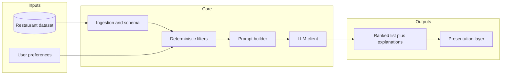
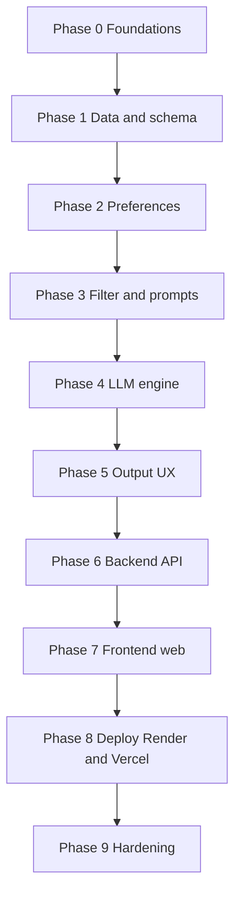
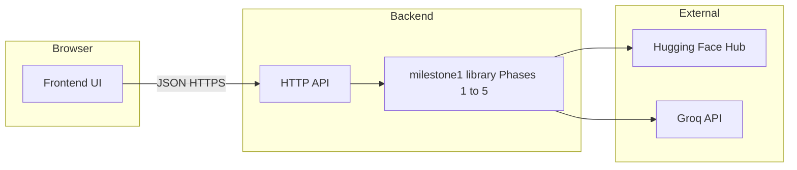
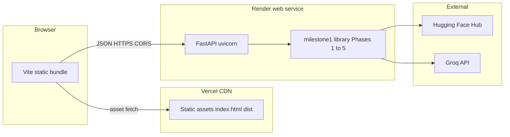

# Phase-wise architecture: restaurant recommendation system

This document breaks the build into **phases** that map to the workflow in [problemstatement.md](./problemstatement.md): data ingestion → user input → integration (filter + prompt prep) → LLM recommendation → output display → **HTTP API (backend)** → **web UI (frontend)** → **deployment** of the API to **Render** and the web UI to **Vercel** for the shipped product.

## High-level system view

After Phase 5, the **product** shape is a small **client–server** system: a **backend** HTTP API wraps the Python pipeline (so secrets and heavy IO stay off the browser), and a **frontend** web app is the primary surface for preferences + results (Phase 0 scope).

**Design principle:** keep **hard constraints** (location, min rating, budget bands) in deterministic code; use the **LLM** for ranking, tie-breaking, natural-language constraints, and explanations—always over a **bounded candidate set** so outputs stay grounded and costs stay predictable.

---

## Phase 0 — Scope and foundations

| Item | Outcome |
|------|--------|
| Product slice | **Basic web UI** — source of user input and primary presentation of results for milestone 1 (see [phase0-scope.md](./phase0-scope.md)); CLI remains for dev/diagnostics. |
| Stack | Language/runtime, dependency manager, where secrets live (e.g. `.env` for API keys, never committed). |
| Dataset contract | Confirm Hugging Face dataset fields you will support in v1; document column → internal field mapping. |
| Non-goals | Explicitly defer (e.g. user accounts, live Zomato API, maps) to avoid scope creep. |

**Exit criteria:** written assumptions (stack, v1 UI, supported preference fields) and a local way to run the app end-to-end once later phases exist.

**Implemented artifacts:** package `src/milestone1/phase0/` (paths, scope, `info`/`doctor` commands), [phase0-scope.md](./phase0-scope.md), [dataset-contract.md](./dataset-contract.md), repo [README.md](../README.md), `.env.example`. CLI: `milestone1 info` / `milestone1 doctor`.

---

## Phase 1 — Data ingestion and canonical model

| Layer | Responsibility |
|-------|----------------|
| **Acquisition** | Download or stream [ManikaSaini/zomato-restaurant-recommendation](https://huggingface.co/datasets/ManikaSaini/zomato-restaurant-recommendation); cache locally if useful for iteration. |
| **Normalization** | Clean types (ratings as numbers, cost as enum or numeric band), handle missing values, dedupe rows if needed. |
| **Canonical schema** | Internal `Restaurant` (or equivalent) with: name, location, cuisines, cost, rating, plus any extra columns you keep for prompts. |

**Exit criteria:** a single module (or package) that loads data and returns a typed in-memory collection or queryable table; unit tests on parsing for a few sample rows.

**Implemented:** package `src/milestone1/phase1_ingestion/` (`Restaurant`, `load_restaurants` / `iter_restaurants`, normalization, Hub revision pin, schema assertion). CLI: `milestone1 ingest-smoke --limit N`. Hub integration tests: `RUN_HF_INTEGRATION=1 pytest -m integration`.

---

## Phase 2 — User preferences and validation

| Component | Responsibility |
|-----------|----------------|
| **Preference model** | Structured fields: location, budget band, cuisine(s), minimum rating; optional free-text for “additional preferences.” |
| **Validation** | Reject or coerce invalid input (unknown location, rating out of range); clear error messages for the UI/CLI. |

**Exit criteria:** preferences deserialize from form/API/CLI args into one object used by the filter layer; validation errors are user-visible.

**Implemented:** package `src/milestone1/phase2_preferences/` (`UserPreferences`, `preferences_from_mapping`, optional `allowed_city_names` corpus check, `allowed_cities_from_restaurants`). CLI: `milestone1 prefs-parse ...` (prints JSON or field errors on stderr).

---

## Phase 3 — Integration layer (retrieval + prompt assembly)

| Component | Responsibility |
|-----------|----------------|
| **Deterministic filter** | Apply hard filters first: location, min rating, budget, cuisine overlap—reduce to top *N* candidates (cap for LLM context, e.g. 15–50). |
| **Ranking hint (optional)** | Pre-sort by rating or composite score so the LLM sees a sensible default order even before reasoning. |
| **Prompt builder** | System + user messages (or single structured prompt) including: user preferences as JSON or bullets; candidate table as markdown/JSON; instructions to **only** recommend from the list; output format (see Phase 4). |

**Exit criteria:** given preferences + loaded dataset, produce a stable `(candidates[], prompt_payload)` without calling the LLM yet; tests for filter edge cases (no matches, too many matches).

**Implemented:** package `src/milestone1/phase3_integration/` (`filter_and_rank`, `build_prompt_payload`, `build_integration_output`). CLI: `milestone1 prompt-build`.

---

## Phase 4 — Recommendation engine (LLM)

| Concern | Approach |
|---------|----------|
| **Model I/O** | Thin client: temperature, max tokens, timeout; inject API key from environment. |
| **Grounding** | Prompt requires the model to cite restaurant **names from the candidate list** only; refuse or return empty if nothing fits. |
| **Structured output** | Ask for JSON (e.g. `rankings[]` with `restaurant_id`, `rank`, `explanation`) or strict markdown sections—then parse and validate. |
| **Resilience** | Retry on transient errors; fallback: return deterministic top-*k* with template explanations if the LLM fails. |

**Exit criteria:** end-to-end call returns ranked items with explanations; parser validates structure; failures degrade gracefully.

**Implemented:** package `src/milestone1/phase4_llm/` (Groq OpenAI-compatible client, JSON rankings parse, deterministic fallback, `recommend_with_groq`). CLI: `milestone1 recommend`. Secrets: `GROQ_API_KEY` (see `.env.example`).

---

## Phase 5 — Output and experience

| Surface | Responsibility |
|---------|----------------|
| **Rendering** | For each recommendation: name, cuisine, rating, estimated cost, AI explanation (per problem statement). |
| **Empty states** | “No restaurants match filters” vs “LLM could not justify picks”—different copy. |
| **Observability (light)** | Log latency, token usage if available, and filter counts (no PII in logs unless required). |

**Exit criteria:** demo path from user input to readable results in one run; copy and layout match the minimum fields in the problem statement.

**Implemented:** package `src/milestone1/phase5_output/` (markdown/plain rendering, empty-state copy, stderr telemetry JSON). CLI: `milestone1 recommend-run` (end-to-end readable output + telemetry).

---

## Phase 6 — Backend (HTTP API)

| Concern | Approach |
|---------|----------|
| **Role** | Thin **HTTP service** that owns server-side secrets (`GROQ_API_KEY`), dataset access, and orchestration. The browser must **not** call Groq or Hugging Face directly. |
| **Contract** | Stable **JSON** request/response for “recommend”: preferences body aligned with Phase 2 keys; response carries ranked items (ids + display fields + explanations), `source` (`llm` / `fallback` / `no_candidates`), filter/candidate counts, and optional non-sensitive telemetry fields for the UI. |
| **Endpoints (v1 intent)** | `POST /api/v1/recommendations` (or equivalent) — validate input, run `load_restaurants` (with limits/caching policy), `recommend_with_groq`, return DTOs. `GET /health` — process up, keys configured (without exposing values). Optional: `GET /api/v1/meta` — e.g. sample `allowed_cities` cap for form hints. |
| **Cross-cutting** | Timeouts aligned with Phase 4; structured **server logs** (counts, latency, token totals—no raw user notes in info-level logs unless you explicitly choose to); **CORS** restricted to the dev frontend origin; request size limits on free-text fields (reuse Phase 2 max length). |
| **Stack** | **Python-first** is natural: e.g. **FastAPI** or **Flask** in `src/` or a sibling package, sharing the installed `milestone1` library. Alternative stacks (Node, etc.) are possible only if they duplicate contracts and call a Python sidecar—avoid unless required. |

**Exit criteria:** frontend can complete one recommendation flow using only the API; API returns the same logical outcomes as `milestone1 recommend` / `recommend-run` for the same inputs (modulo caching).

**Implemented:** package `src/milestone1/phase6_api/` (FastAPI app, `POST /api/v1/recommendations`, `GET /health`, `GET /api/v1/meta`, CORS via `CORS_ORIGINS`, `PreferencesValidationError` → 422). Run: `milestone1-api` (or `uvicorn milestone1.phase6_api.app:app`). See [README.md](../README.md).

---

## Phase 7 — Frontend (web UI)

| Concern | Approach |
|---------|----------|
| **Role** | Primary **user-facing** surface: preference form + results list, per [phase0-scope.md](./phase0-scope.md). |
| **Data flow** | Browser **only** talks to the Phase 6 API. Map form fields to the API JSON schema (location, budget band, cuisines, minimum rating, optional additional text). |
| **UI** | Results show **name, cuisines, rating, estimated cost, AI explanation** for each row; reuse Phase 5 **empty-state** semantics (“no filter match” vs “model returned no grounded picks”) with clear, distinct copy. |
| **UX** | Loading states, validation errors inline, disabled submit while pending; optional “copy as Markdown” for demo. |
| **Stack** | Choose one and stay consistent: e.g. **React + Vite** (SPA) or **HTMX + server templates** (minimal JS). Host locally for milestone 1; no production SLA required in Phase 0. |

**Exit criteria:** one demo path in the README: start API + UI, submit preferences, see ranked results or an intentional empty state.

**Implemented:** Vite + React app in [`frontend/`](../frontend/) (TypeScript, Tailwind). README: “Run the web app”.

**UI / design assist:** use [frontend-stitch-prompt.md](./frontend-stitch-prompt.md) with **Google Stitch** to generate mockups or starter UI aligned to the Phase 6 API.

---

## Phase 8 — Deployment (Render backend + Vercel frontend)

| Concern | Approach |
|---------|----------|
| **Role** | Ship the Phase 6 API and the Phase 7 web UI as **two independent deployments**: FastAPI to **Render** (server-side: owns `GROQ_API_KEY`, Hugging Face access, orchestration) and the Vite + React SPA to **Vercel** (browser-only, statically built, calls the Render URL). |
| **Backend (Render)** | Web Service running `uvicorn milestone1.phase6_api.app:app --host 0.0.0.0 --port $PORT`. Build with `pip install -e .` (no extras needed). Free-tier dynos sleep when idle—cold starts are expected; the existing `_prewarm` thread warms locations on startup. Health check: **`GET /health`**. Secrets via Render env vars: **`GROQ_API_KEY`** (required), optional **`GROQ_MODEL`**, optional **`HF_TOKEN`**. **`CORS_ORIGINS`** must list the Vercel deployment(s). |
| **Frontend (Vercel)** | Static build of `frontend/` (Vite). **Root Directory:** `frontend/`. **Build:** `npm install && npm run build`. **Output:** `dist`. Single env var: **`VITE_API_BASE_URL=https://<render-service>.onrender.com`** (baked at build time). No server-side runtime; SPA fallback rewrites all paths to `index.html`. |
| **Secrets boundary** | `GROQ_API_KEY` and `HF_TOKEN` live **only on Render**. The Vercel bundle is browser-public; never put provider keys in `VITE_*` vars. CORS on the Render side is the only permitted cross-origin path. |
| **Relationship to Phase 6–7** | **Direct lift:** Phase 6 is what Render serves; Phase 7 is what Vercel serves. No new code paths—just hosting + env wiring. |

**Exit criteria:** [`docs/deployment.md`](./deployment.md) documents repo prep, Render service config, Vercel project config, env vars, and CORS wiring; a reviewer can open the Vercel URL, submit preferences, and get a Groq-backed recommendation served by Render — or an intentional empty state on `no_candidates` / `fallback`.

**Implemented:** see [`docs/deployment.md`](./deployment.md). No new packages — Phase 8 is configuration over Phases 6 and 7.

---

## Phase 9 — Hardening and handoff (optional but recommended)

- Automated tests for filters, prompt shape, JSON parsing (fixtures with fake LLM responses), and **API contract** tests (golden JSON for happy/empty/error paths).
- README: install, set **`GROQ_API_KEY`**, run API + UI, CLI fallbacks, and limitations (dataset revision, rate limits, candidate cap).
- Cost/latency notes: candidate cap, model id, when to raise `load` limits, caching strategy for repeated queries (optional in-process LRU of recent Hub windows—only if measured need).

---

## Phase dependency order

Phases **0–2** can overlap slightly (e.g. stub UI while data loads), but **3** should not depend on the LLM until filters are correct; **4** should not own business rules that belong in **3**. The **frontend (7)** must not skip the **API (6)** for provider keys or dataset access. **Phase 8** is hosting only — it never moves provider keys into the browser bundle; **Groq** and **Hugging Face** access stay on Render.

---

## Runtime view (target: after Phase 7)

### Deployment view (Phase 8)

`VITE_API_BASE_URL` (Vercel build env) points the SPA at the Render URL. `GROQ_API_KEY` lives only on Render. CORS on Render is locked down to the Vercel origin(s).

---

## Traceability to the problem statement

| Problem statement section | Primary phase |
|---------------------------|---------------|
| Data ingestion | 1 |
| User input | 2 |
| Integration layer | 3 |
| Recommendation engine | 4 |
| Output display | 5 |
| **Serving the product (API)** | **6** |
| **Serving the product (browser UI)** | **7** |
| **Deployment (Render + Vercel)** | **8** |
| **Hardening, tests, README handoff** | **9** |

This keeps the architecture **phase-wise** for planning and milestones while preserving a **layered** runtime design (data → rules → model → presentation), then a **client–server shell** (API + UI) around that core, deployed as a Render service plus a Vercel static site.
